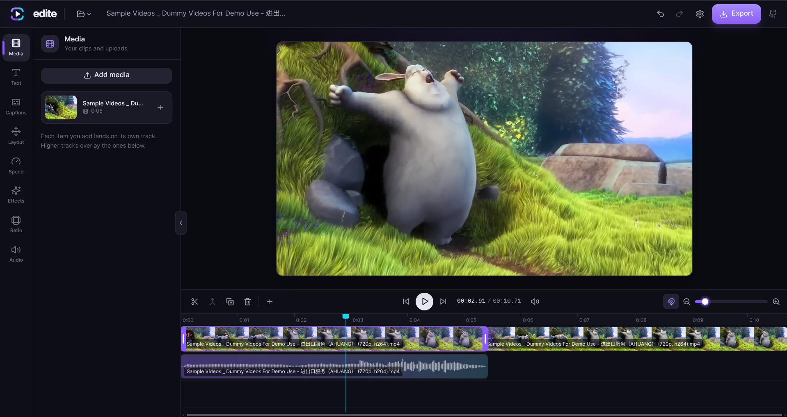

# Edite

[Edite](https://edite.video) is a free, multi-track video editor that runs **entirely in the browser**, working great in both desktop and mobile. 
Import videos and images, stack them on layered tracks, trim/split/speed/reframe, add picture-in-picture overlays, and export a composited MP4/WebM/GIF. No account, no upload, no server: your media never leaves the device.

## Why it exists

- **100% Free.** Created this after being tired on all "freemium" options require paid subs or logins for export options or other features, edite will always be 100% free and opensource.
- **Privacy by construction.** Most "online video editors" upload your footage to a backend. edite
  does all decoding, compositing and encoding locally, so there is nothing to leak and nothing to
  trust.
- **Zero infrastructure.** The whole app is a static bundle on GitHub Pages. There is no API, no
  database, no storage bill, and no ops.

## Features / capabilities

A full editing toolkit, all running locally in your browser:

### Timeline & editing

- **Multi-track timeline.** Stack layered tracks that composite bottom-to-top, so you get real overlays and picture-in-picture, not one clip at a time.
- **Core cuts.** Trim, split, merge, duplicate, copy/paste and ripple-delete, with snapping to clip edges and the playhead.
- **WYSIWYG preview.** A live preview that matches the exported file, plus multi-step undo/redo.
- **Keyboard-first.** Space/K to play, S to split, F to freeze, J to merge, undo/redo, arrow-key scrubbing and more.

### Transform & motion

- **Free transform.** Position, scale, rotate, flip and opacity on any clip.
- **Keyframe animation.** Animate position + scale for Ken Burns pans/zooms and moving picture-in-picture.
- **Aspect ratios.** 16:9, 9:16, 1:1, 4:5, 4:3, 21:9 or match the source, with a solid-color canvas background behind clips that don't fill the frame.

### Speed & time

- **Constant speed** from 0.25x to 4x, plus **reverse** and **freeze-frame**.
- **Speed curves.** Ramp up, ramp down and bullet-time slow-mo.

### Color & effects

- **One-tap filters** and a full **Adjust** grade: exposure, brightness, contrast, saturation, temperature, tint, highlights, shadows, sharpen and vignette, with an intensity mix.
- **3D LUTs.** Seven bundled looks, or import your own `.cube` files.
- **Chroma key.** Green/blue-screen removal with adjustable similarity and edge blend.

### Text, captions & shapes

- **Text overlays** with two dozen built-in fonts (or import your own), outline, shadow, background box, alignment and enter/exit animations.
- **Auto-captions, on device.** Transcribe speech with Whisper (from Tiny to Turbo) across 13 languages plus auto-detect, WebGPU-accelerated, and restyle every line at once with caption presets.
- **Shapes & stickers.** Rectangle, ellipse, triangle, diamond, star and arrow with fill, stroke and corner radius.

### Transitions & audio

- **Transitions.** Dissolve, fade to black/white, slides, wipes and iris.
- **Audio.** Per-clip volume and fades with timeline waveforms, extract-audio from video, and clip/track/master mute.

### Export

- **Formats:** MP4, WebM and GIF for video; MP3 or WAV for audio-only.
- **Up to 4K** at 24-60 fps, with quality presets or a custom bitrate target.
- **Platform presets** for TikTok/Reels, YouTube, Shorts and Instagram.

### Projects & install

- **Local projects.** Multiple projects autosaved to IndexedDB; export/import a self-contained `.edite` bundle (project + media) to back up or move between devices.
- **Installable PWA** that keeps working offline once loaded.
